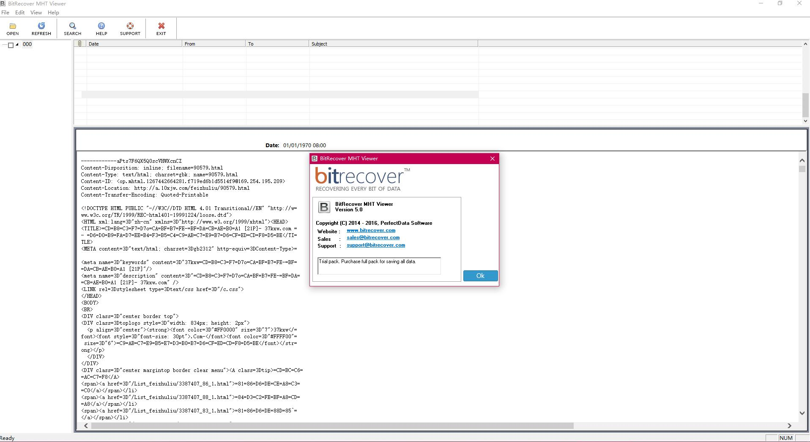
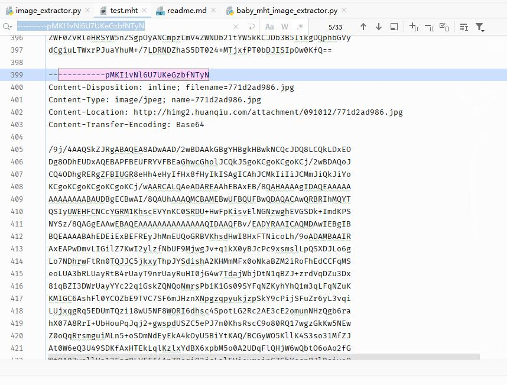

.mht文件图片解析工具
=================

网上找了一下没有找到比较现成的好用的工具，找到一个mht-viewer 的windows下的查看工具，但是实际实用的时候发现啥都看不了，就是个文本编辑器？还是我打开的姿势不对？

  

并且对于中文目录和文件名直接无法显示，我都不知道查看的是什么东西,就这个还尼玛有付费版本？  

搜索了一下发现了几个python脚本，实际使用效果也一般。网上搜索了一下并没有找到相关的文件格式的说明

直接查看文件就可以发现文件格式并不是十分复杂，于是可以遍历来解析文件中的图片

已经保存的图片如下：

在文件中的存储结构如下：

虽然现在mht文件中的资源链接已经全部都挂了，但是所有的资源都是本地保存的，所以要还原对应的图片，只需要将对应的base64加密的字符串解密，然后写入文件即可

资源的存储方式则是通过 boundary=----------pMKI1vNl6U7UKeGzbfNTyN 进行分隔，在文件的第一行已经定义了边界分隔字符串，通过这个值即可将所有的资源全部分隔出来

- 第一段

>Content-Type: multipart/related; start=<op.mhtml.1267442701515.fe60c16c115c15f9@169.254.195.209>; boundary=----------pMKI1vNl6U7UKeGzbfNTyN
Content-Location: http://a.10xjw.com/feizhuliu/89905.html  
Subject: =?utf-8?Q?=E8=B6=85=E7=BE=8E=E4=B8=9D=E6=8E=A7=E5=A7=90=E5=A6=B9=E8=8A=B1=E7=A7=92=E6=9D=80=E4=BD=A0=E6=B2=A1=E9=97=AE=E9=A2=98[26P]-=2037kxw.com=20-=20=E4=B8=AD=E5=9B=BD=E6=9C=80=E5=A4=A7=E7=9A=84=E8=89=B2=E6=83=85=E5=88=86=E4=BA=AB=E7=BD=91=E7=AB=99?=
MIME-Version: 1.0  

第一段定义了文件类型 边界 原始url 原始网页标题以及 版本号

- 第二段
>------------pMKI1vNl6U7UKeGzbfNTyN  
Content-Disposition: inline; filename=89905.html  
Content-Type: text/html; charset=gbk; name=89905.html  
Content-ID: <op.mhtml.1267442701515.fe60c16c115c15f9@169.254.195.209>  
Content-Location: http://a.10xjw.com/feizhuliu/89905.html  

第二段则定义了html源码相关的内容，具体可以参考相关的源码

- 后续段落
>------------pMKI1vNl6U7UKeGzbfNTyN  
Content-Disposition: inline; filename=c.css  
Content-Type: text/css; charset=gbk; name=c.css  
Content-Location: http://a.10xjw.com/c.css  
Content-Transfer-Encoding: 8bit  

后续段落则开始记录相关的资源包括css 图片 js等所有的资源信息。所以mht文件的好处是一个文件记录了所有的内容，并且后续及时网络已经无法访问也可以正常的浏览

而我这里关注的则只有图片信息， 图片信息结构如下：

> ------------pMKI1vNl6U7UKeGzbfNTyN  
Content-Disposition: inline; filename=771d2ad986.jpg  
Content-Type: image/jpeg; name=771d2ad986.jpg  
Content-Location: http://himg2.huanqiu.com/attachment/091012/771d2ad986.jpg  
Content-Transfer-Encoding: Base64  

>/9j/4AAQSkZJRgABAQEA8ADwAAD/2wBDAAkGBgYHBgkHBwkNCQcJDQ8LCQkLDxEO
Dg8ODhEUDxAQEBAPFBEUFRYVFBEaGhwcGholJCQkJSgoKCgoKCgoKCj/2wBDAQoJ
CQ4ODhgRERgZFBIUGR8eHh4eHyIfHx8fHyIkISAgICAhJCMkIiIiJCMmJiQkJiYo
KCgoKCgoKCgoKCgoKCj/wAARCALQAeADAREAAhEBAxEB/8QAHAAAAgIDAQEAAAAA
AAAAAAAABAUDBgECBwAI/8QAUhAAAQMCBAMEBwUFBQUFBwQDAQACAwQRBRIhMQYT

保存文件所需的所有的信息已经都存在了，包活文件名，文件类型，原始的路径以及图片base64编码

所以只要将对应的数据解密然后保存下载就一切都ok了

文件名可能存在过长拆分的问题：

>------------uNdOxD6YsQZMV8KY8Zldv3  
Content-Disposition: inline; filename*0="y1pGpLTMzlEMSYejPYdz8DuYH_ttGFJ-9PPezzT7";  
 filename*1="XtK1BlVN9nlq92nDSZcjEGAGO_N9YAw5PtCWc-aX9QBcPpgcg.jpeg"  
Content-Type: image/jpeg; name*0="y1pGpLTMzlEMSYejPYdz8DuYH_ttGFJ-9PPezzT7";  
 name*1="XtK1BlVN9nlq92nDSZcjEGAGO_N9YAw5PtCWc-aX9QBcPpgcg.jpeg"  
Content-Location: http://public.blu.livefilestore.com/y1phEb_sfR0Z7hVsySTRZ06sRwVSc7LI_whCIjV-xzTuqm1embz8wPPtC0eXr69ZaLGUC3xzk3Ex6ppUyPb2XG_eg/anri_big18.jpg  
Content-Transfer-Encoding: Base64  

我直接采用了简单粗暴的方式，如果文件名过长直接使用default.jpg进行命名。如果需要原始文件名可以将对应的filename 全部进行拼接即可。

@author: obaby  
@license: (C) Copyright 2013-2020, obaby@mars.  
@contact: root@obaby.org.cn  
@link: http://www.obaby.org.cn  
        http://www.h4ck.org.cn  
        http://www.findu.co  
@file: baby_mht_image_extractor.py  
@time: 2020/5/22 20:46  
@desc:  

